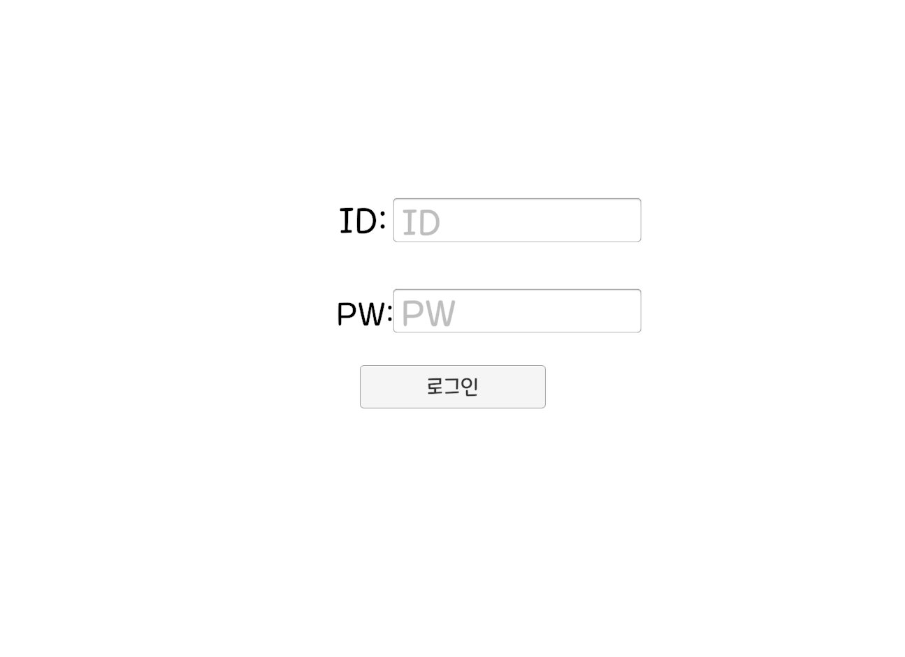

# IOCP를 이용한 오목 게임 서버

 
 
 

## 프로젝트 간단 소개

IOCP 서버에 채팅과 오목의 기능을 구현한 프로젝트다.

큰 프로세스는 
로그인 -> 로비 입장 -> 방 입장 -> 준비 확인 -> 게임 진행 
의 프로세스로 진행된다.

## 기술 스택
* 서버: C++
* 클라이언트: Unity
* DB: MySQL

## 구현 기능
* 로그인
* 로그아웃
* 로비에서 방 정보 호출
* 방 입장
* 방 퇴장
* 채팅
* 게임 준비
* 오목 게임 진행
* 게임 종료

## 아쉬운 점
1. DB 커넥션 클래스를 만들면서 로그인을 진행할 때 사용하는 Select 함수 부분에 escape를 하지 못했다.
2. 서버에서 로비에 있는 사람들에게 정보를 전달하기 위해 로비에 있는 사람만 따로 필터링하는데 그 때 찾는 방식이 O(n)이다. 이렇게 진행하지 말고 아예 새로운 리스트 멤버변수를 만들어서 O(1)로 진행했으면 더 좋았을거라고 생각한다.
3. 지금 서버는 패킷 매니저에 모든 기능을 다 집어넣었지만 실제로는 수많은 기능을 담당해야 하기 때문에 다른 파일에 집어넣을것이다. 기능에 맞는 새로운 클래스에 넘겨줘서 함수를 진행시켰으면 더 보기도 편하고 유지보수도 편했을거라고 생각한다.

## 배운 점
기존에는 IOCP 서버를 만들기만 하고 채팅서버에서 끝난 느낌으로 진행했었지만 이번에는 실제로 하나의 프로젝트를 진행해보면서 내가 이전에 다녔던 회사의 경험을 바탕으로 실무에서 어떻게 했을까를 생각해볼 수 있었던 좋은 기회였다. 
아마 지금 만든 방식 중 로그인 방식은 사이드 프로젝트 용으로 DB를 사용하기 위해서 옛날 방식처럼 진행했지만 요즘은 웹서버에서 로그인 인증절차를 거치고 게임 스타트를 하기 때문에 JWT와 같은 토큰 방식으로 게임 서버에게 전달해줄거라고 생각한다. 
그렇게 된다면 내 서버에서는 세션 클래스가 클라이언트의 정보를 담고있는 클래스이기 때문에 거기에 토큰값이 들어가있을것이다. 만약 토큰값을 사용하게 된다면 게임 내에서 직접 캐시 아이템을 사는 경우에 사용될 수 있을것이라고 생각한다.
